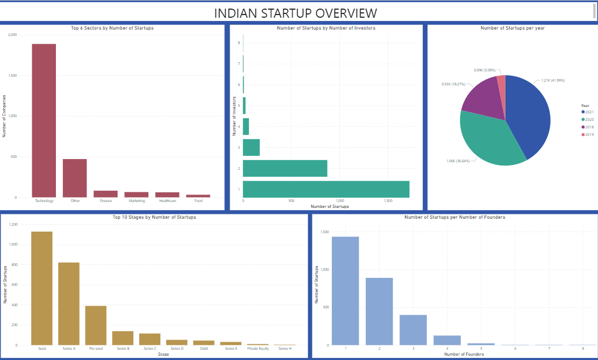
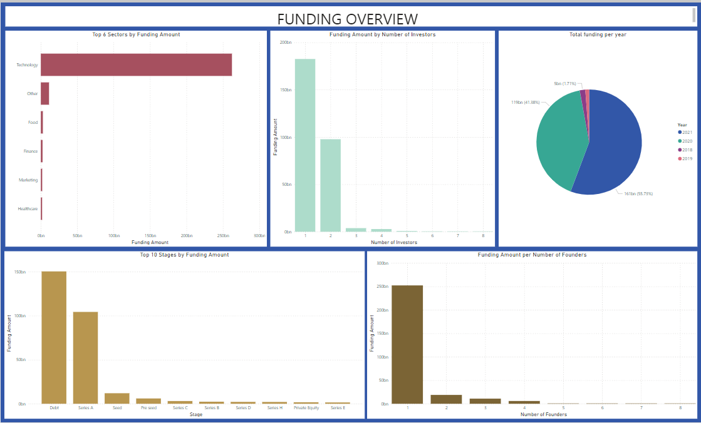

# Indian Startup Ecosystem - Data Analysis Project
This project explores the Indian startup ecosystem using publicly available data. The goal is to gain insights into the current landscape, identify trends, and potentially highlight opportunities and challenges faced by startups in India.

#### Snipets from the analysis 

## Project Structure
This repository contains some of the raw data used for analysis. 

notebooks: The main.ipynb notebook contains the code used to carry out the project I

README.md (This file) - Provides an overview of the project.

### Tools and Technologies
Python (programming language)
pandas (data manipulation library), numpy 
Additional libraries like matplotlib, seaborn for data visualization
Jupyter Notebook (or your preferred coding environment)
### Data Sources
The data sources used in this project include a database, and other online sources
the database holds data for the years 2021 and 2020, while the 2018 data is from github and the 2019 data from onedrive 

### Getting Started
Clone this repository: git clone https://github.com/noemie-wanjiru/startup-funding-analysis.git
Install required libraries: pip install -r requirements.txt 
Refer to the comments in the main jupyter notebook for more details 
### License 
This porjects utilises the MIT License.
### Disclaimer
Include a disclaimer if the data or analysis is for educational purposes only and may not be entirely representative of the entire Indian startup ecosystem. 
 
